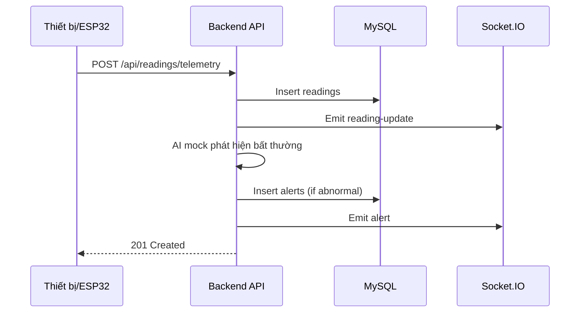
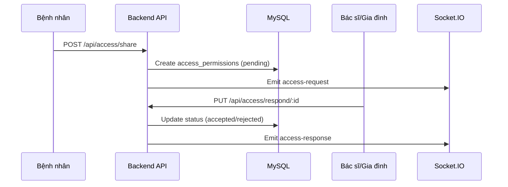
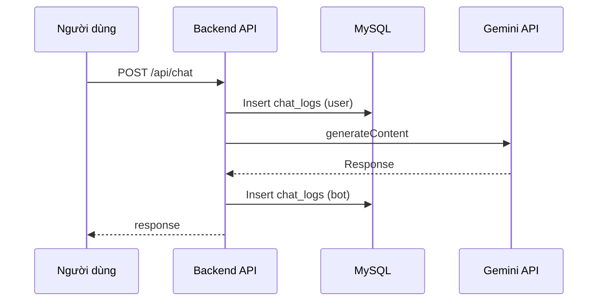

# Backend - Hướng dẫn đọc hiểu nhanh

Tài liệu này giúp thành viên mới nắm cấu trúc và luồng chính của backend Ironman Holter.

## Tổng quan
- **Stack**: Node.js + Express + Prisma (MySQL) + Socket.IO.
- **Tính năng chính**: quản lý người dùng/thiết bị, nhận telemetry ECG, cảnh báo realtime, báo cáo bác sĩ, chia sẻ quyền, chatbot Gemini.
- **Vai trò**: bệnh nhân, bác sĩ, gia đình, admin (lưu bằng tiếng Việt trong DB, map qua enum trong Prisma).

## Cấu trúc thư mục quan trọng
- `server/server.js`: khởi tạo Express, Socket.IO, routes, kết nối DB.
- `server/prisma/schema.prisma`: mô tả schema hiện tại (map tới bảng MySQL hiện có).
- `server/prismaClient.js`: khởi tạo Prisma Client; tự build `DATABASE_URL` từ `DB_*` nếu chưa có.
- `server/controllers/`: xử lý nghiệp vụ cho từng route.
- `server/routes/`: khai báo API endpoints.
- `server/services/socketService.js`: xử lý realtime (rooms, stream ECG giả lập, cảnh báo).
- `server/utils/enumMappings.js`: map giữa enum Prisma và chuỗi tiếng Việt trong DB.
- `server/views/readings.ejs`: trang EJS test đọc ECG.

## Cấu hình môi trường
Backend đọc `.env` ở thư mục root (`server` sẽ load `../.env`).
Các biến quan trọng:
- `DB_HOST`, `DB_USER`, `DB_PASS`, `DB_NAME`, `DB_PORT` (hoặc `DATABASE_URL`).
- `JWT_SECRET`.
- `GEMINI_API_KEY`.
- `PORT`, `CLIENT_URL`.

## Luồng dữ liệu chính
1) **Telemetry ECG**
- ESP32/thiết bị gửi data: `POST /api/readings/telemetry`.
- Lưu vào DB, phát event realtime `reading-update` qua Socket.IO.
- Nếu phát hiện bất thường (AI mock), tạo alert và phát event `alert`.

2) **Dữ liệu giả lập**
- `POST /api/readings/fake`: tạo ECG giả + phân loại AI mock.
- Bắn event realtime `fake-reading`.

3) **Cảnh báo**
- Tạo cảnh báo thủ công: `POST /api/alerts`.
- Bắn event realtime `alert`.

4) **Chatbot AI**
- `POST /api/chat`: gửi prompt tới Gemini, lưu `chat_logs`, trả về response.

## Realtime (Socket.IO)
- Join room theo user: `join-user-room` -> nhận cảnh báo cá nhân.
- Join room theo role: `join-role-room` (bác sĩ/gia đình/admin).
- Join room theo device: `join-device-room` -> stream ECG.
- Các event chính: `reading-update`, `fake-reading`, `alert`, `new-alert`, `patient-alert`, `family-alert`.

## Data model (tóm tắt)
- **User**: `user_id`, `role`, `is_active`.
- **Device**: `device_id`, `user_id`, `status`.
- **Reading**: ECG signal, `heart_rate`, `ai_result`.
- **Alert**: cảnh báo theo `user_id` (có thể gắn `reading_id`).
- **Report**: báo cáo bác sĩ -> bệnh nhân.
- **ChatLog**: lịch sử hội thoại.
- **AccessPermission**: chia sẻ quyền bệnh nhân -> bác sĩ/gia đình.
- **MedicalHistory**: bệnh sử, chẩn đoán, thuốc, soft-delete (`deleted_at`).

## Các route chính
- Auth: `POST /api/auth/register`, `POST /api/auth/login`, `GET /api/auth/me`.
- Users: `GET /api/users`, `PUT /api/users/:id`, `DELETE /api/users/:id`.
- Devices: `POST /api/devices/register`, `GET /api/devices/:user_id`.
- Readings: `POST /api/readings/telemetry`, `POST /api/readings/fake`, `GET /api/readings/:device_id`.
- Alerts: `POST /api/alerts`, `GET /api/alerts/:user_id`.
- Reports: `POST /api/reports/:user_id`, `GET /api/reports/:user_id`.
- Access: `POST /api/access/share`, `PUT /api/access/respond/:id`, `GET /api/access/list/:patient_id`.
- Medical history: `GET /api/history/:user_id`, `POST /api/history`, `PUT /api/history/:id`.

## Lưu ý kỹ thuật
- `authenticateToken` hiện là stub (chỉ `next()`), cần hoàn thiện nếu triển khai thật.
- Trạng thái/role trong DB lưu tiếng Việt; dùng `enumMappings` để map qua Prisma.
- Prisma schema map trực tiếp bảng hiện có, không thay đổi cấu trúc DB.

## Chạy backend (local)
```bash
cd server
npm install
npm run dev
```

Nếu dùng Prisma Client mới:
```bash
npx prisma generate
```

## Gợi ý kiểm thử nhanh
- Tạo user -> login -> lấy token.
- Đăng ký device -> gửi telemetry -> kiểm tra Socket.IO event.
- Tạo alert và kiểm tra realtime.

---

## Sơ đồ sequence (Mermaid)
### 1) Telemetry ECG và cảnh báo realtime


### 2) Chia sẻ quyền truy cập hồ sơ


### 3) Chatbot AI


## Schema chi tiết (tóm tắt)
### users
- Chức năng: quản lý tài khoản, vai trò và trạng thái hoạt động.
- `user_id` (INT, PK, auto increment)
- `name` (VARCHAR)
- `email` (VARCHAR, unique)
- `password_hash` (VARCHAR)
- `role` (ENUM: bệnh nhân/bác sĩ/gia đình/admin)
- `is_active` (BOOLEAN)
- `created_at`, `updated_at` (DATETIME)

### devices
- Chức năng: lưu thiết bị Holter, gắn với người dùng và trạng thái sử dụng.
- `device_id` (VARCHAR, PK)
- `user_id` (INT, FK -> users.user_id)
- `serial_number` (VARCHAR, unique)
- `status` (ENUM: đang hoạt động/ngừng hoạt động)
- `created_at`, `updated_at` (DATETIME)

### readings
- Chức năng: lưu dữ liệu ECG/nhịp tim theo thời gian.
- `reading_id` (INT, PK, auto increment)
- `device_id` (VARCHAR, FK -> devices.device_id)
- `timestamp` (DATETIME)
- `heart_rate` (INT)
- `ecg_signal` (JSON)
- `abnormal_detected` (BOOLEAN)
- `ai_result` (VARCHAR, nullable)

### alerts
- Chức năng: lưu cảnh báo bất thường/khẩn cấp theo người dùng và phiên đo.
- `alert_id` (INT, PK, auto increment)
- `user_id` (INT, FK -> users.user_id)
- `reading_id` (INT, FK -> readings.reading_id, nullable)
- `alert_type` (VARCHAR)
- `message` (TEXT)
- `timestamp` (DATETIME)
- `resolved` (BOOLEAN)

### reports
- Chức năng: báo cáo bác sĩ lập cho bệnh nhân.
- `report_id` (INT, PK, auto increment)
- `user_id` (INT, FK -> users.user_id)
- `doctor_id` (INT, FK -> users.user_id, nullable)
- `summary` (TEXT)
- `created_at` (DATETIME)

### chat_logs
- Chức năng: lưu lịch sử hội thoại người dùng và chatbot.
- `chat_id` (INT, PK, auto increment)
- `user_id` (INT, FK -> users.user_id)
- `role` (ENUM: user/bot)
- `message` (TEXT)
- `timestamp` (DATETIME)

### access_permissions
- Chức năng: quản lý chia sẻ quyền xem hồ sơ (pending/accepted/rejected).
- `permission_id` (INT, PK, auto increment)
- `patient_id` (INT, FK -> users.user_id)
- `viewer_id` (INT, FK -> users.user_id)
- `role` (ENUM: bác sĩ/gia đình)
- `status` (ENUM: pending/accepted/rejected)
- `created_at`, `updated_at` (DATETIME)

### medical_histories
- Chức năng: lưu bệnh sử, chẩn đoán, thuốc; hỗ trợ soft-delete.
- `history_id` (INT, PK, auto increment)
- `user_id` (INT, FK -> users.user_id)
- `doctor_id` (INT, FK -> users.user_id, nullable)
- `ai_diagnosis` (TEXT, nullable)
- `doctor_diagnosis` (TEXT, nullable)
- `symptoms` (TEXT, nullable, lưu JSON string)
- `medication` (TEXT, nullable)
- `condition` (TEXT, nullable)
- `notes` (TEXT, nullable)
- `created_at`, `updated_at` (DATETIME)
- `deleted_at` (DATETIME, nullable)

## Quan hệ chính
- User 1-n Device, Reading (thông qua Device), Alert, ChatLog.
- User 1-n Report (vai trò Patient) và 1-n Report (vai trò Doctor).
- User 1-n AccessPermission (patient/viewer).
- User 1-n MedicalHistory (patient/doctor).

